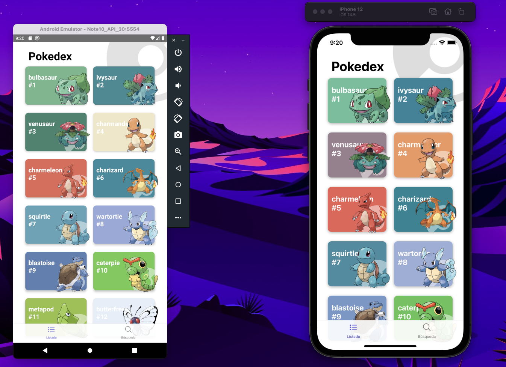
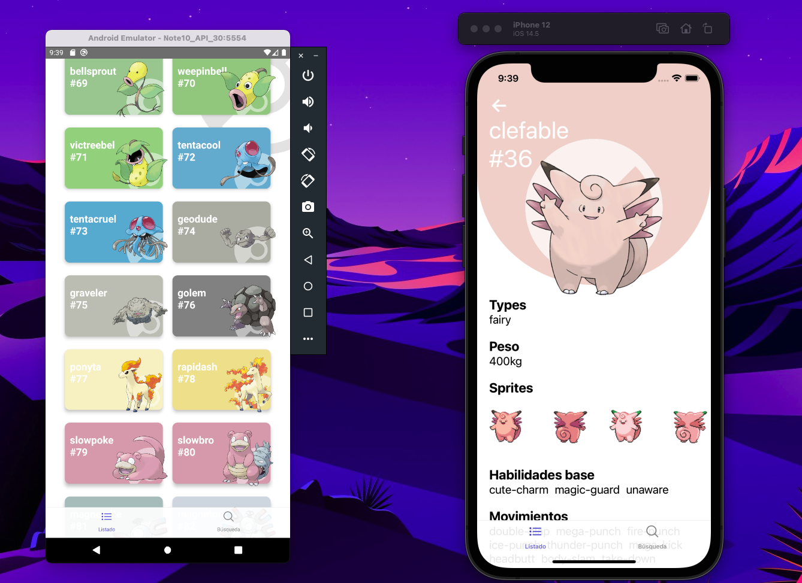

<p align="center">
    <h1>Componentes en React Native</h1>
</p>

# Install
```
step 1 - yarn install
step 2 - npx pod-install  
step 3 - npx react-native run-android 
step 4 - npx react-native run-ios 
```
## App Pokedex made in React Native, from Fernando Herrara's course in which I learned concepts such as:
* Create a Pokedex, application to display information about Pokemons
* Consume APIs
* Component reuse
* InfiniteScroll real
* Elegant design and tips
* Lazy loading of images
* Pokemons search by name or by ID
* Implement a debouncer with a hook


-----------------------------------------
## Español
## Pokedex App realizada en React Native , del curso de Fernando Herrara en el cual aprendí conceptos como:
* Crear un Pokedex, aplicación para mostrar información de Pokemons
* Consumir APIs
* Reutilización de componentes
* InfiniteScroll real
* FadeIn y FadeOut animacion
* Diseño elegante y tips
* Carga perezosa de imágenes
* Buscador de Pokemons por nombre o por ID
* Implementar un debouncer con un hook







# Video demostración:
[Youtube](https://www.youtube.com/watch?v=xwwS7R9TEIo)


## Mi canal de youtube 

[Youtube](https://www.youtube.com/channel/UCQsrs_h91Q-baLx-n_rcdNg)

## Mis articulos en medium
[medium](https://devjaime.medium.com/)


## Mi twitter por si quieres contacterme
[medium](https://twitter.com/HsJhernandez)

### :heart: ¿Te gusto este proyecto?

Si te gusto este proyecto comparte y dale una estrella :star: en Github y no dudes en contactarme.